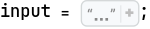
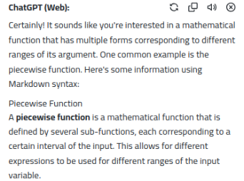
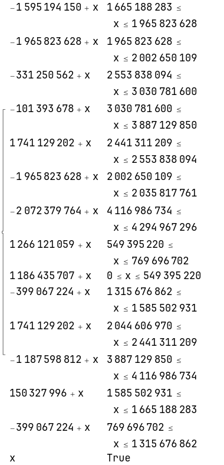
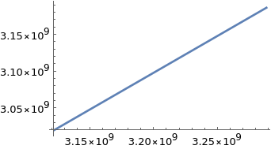
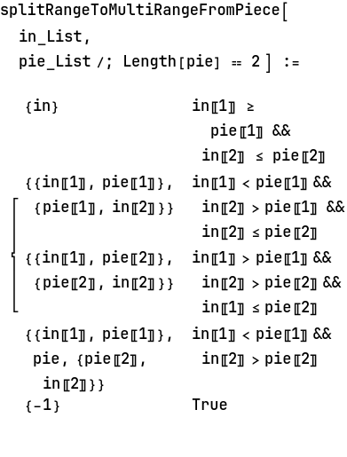
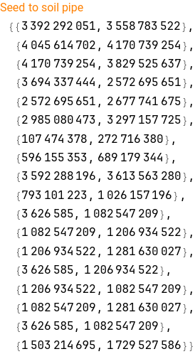

```mathematica
{seed, seedToSoil, soilToFer, ferToWater, waterToLight, lightToTemperature, tempToHumidity, humidToLocation} = StringSplit[input, "\n\n"] ;
```

```mathematica
seedParse = ToExpression /@ ((StringCases[input, RegularExpression["seeds:.*"]] //StringSplit[#, ":"] & ) // #[[1]][[2]] & // StringCases[#, DigitCharacter ..] &)

(*{3121711159, 166491471, 3942191905, 154855415, 3423756552, 210503354, 2714499581, 312077252, 1371898531, 165242002, 752983293, 93023991, 3321707304, 21275084, 949929163, 233055973, 3626585, 170407229, 395618482, 226312891}*)
```

```mathematica
parseMap[map_String] := Module[{mapNumberList = Map[ToExpression, StringCases[#, DigitCharacter ..] & 
       /@  StringSplit[map, "\n"][[2 ;;]] , 2]} , 
   <|"des" -> #1, "src" -> #2, "step" -> #3 |> & @@@ mapNumberList]
```

```mathematica
parseMap[soilToFer]

(*{<|"des" -> 69994133, "src" -> 1665188283, "step" -> 300635345|>, <|"des" -> 0, "src" -> 1965823628, "step" -> 36826481|>, <|"des" -> 2222587532, "src" -> 2553838094, "step" -> 476943506|>, <|"des" -> 2929387922, "src" -> 3030781600, "step" -> 856348250|>, <|"des" -> 4182440411, "src" -> 2441311209, "step" -> 112526885|>, <|"des" -> 36826481, "src" -> 2002650109, "step" -> 33167652|>, <|"des" -> 2044606970, "src" -> 4116986734, "step" -> 177980562|>, <|"des" -> 1815516279, "src" -> 549395220, "step" -> 220301482|>, <|"des" -> 1186435707, "src" -> 0, "step" -> 549395220|>, <|"des" -> 916609638, "src" -> 1315676862, "step" -> 269826069|>, <|"des" -> 3785736172, "src" -> 2044606970, "step" -> 396704239|>, <|"des" -> 2699531038, "src" -> 3887129850, "step" -> 229856884|>, <|"des" -> 1735830927, "src" -> 1585502931, "step" -> 79685352|>, <|"des" -> 370629478, "src" -> 769696702, "step" -> 545980160|>}*)
```

Boring, despite look so long, I guess, we transform each map to function, kind of function that have different form base on the  interval of argument. Oh let me ask ChatGPT, I forget what naming this kind of function is called.




Oh, correct, that kid answer me that is piecewise function.  🤯. 


what kind of math function we will abstract 

```mathematica
<|"des" -> 69994133, "src" -> 1665188283, "step" -> 300635345|>

(*<|"des" -> 69994133, "src" -> 1665188283, "step" -> 300635345|>*)
```

Suppose we have x as input number(the number from source we need to convert), we have  src <= x <= src+ step and  y = des + s, with des <= y <= des+step, 0<=s <= step.  the s = x - src (s is difference between the input and the source)

So y = des + x - src  = des - src + x


Wow, 🎇, so surprise, both des, src, and x is clearly . 

```mathematica
2 + x  

(*2 + x*)
```


```mathematica

```

```mathematica
Piecewise[{#["des"] - #["src"] + x, #["src"] <= x <= #["src"] + #["step"]} & /@ parseMap[soilToFer], x]
```



```mathematica

```

```mathematica
piecewiseFromMap[map_List] := Piecewise[{#["des"] - #["src"] + x, #["src"] <= x <= #["src"] + #["step"]} & /@ map, x]
```

```mathematica
pipeMapChain[inputNum_Integer] := Module[{
    seedToSoilPipe = piecewiseFromMap[parseMap[seedToSoil]], 
    soilToFerPipe = piecewiseFromMap[parseMap[soilToFer]], 
    ferToWaterPipe = piecewiseFromMap[parseMap[ferToWater]], 
    waterToLightPipe = piecewiseFromMap[parseMap[waterToLight]], 
    lightToTemperaturePipe = piecewiseFromMap[parseMap[lightToTemperature]], 
    tempToHumidityPipe = piecewiseFromMap[parseMap[tempToHumidity]], 
    humidToLocationPipe = piecewiseFromMap[parseMap[humidToLocation]] 
   }, 
   a = seedToSoilPipe /. x -> inputNum; 
   b = soilToFerPipe /. x -> a; 
   c = ferToWaterPipe /. x -> b; 
   d = waterToLightPipe /. x -> c; 
   e = lightToTemperaturePipe /. x -> d; 
   f = tempToHumidityPipe /. x -> e; 
   g = humidToLocationPipe /. x -> f; 
   g 
  ]

```

```mathematica
pipeMapChain[#] & /@ seedParse // Min

(*535088217*)
```

😆 Numbers is so big like USD => Vietnam Dong that make me almost think I will wrong at first attempt, but no, it ' s correct . 

## Part 2

```mathematica
#[[2]] & /@ (seedParse // Partition[#, 2] & )

(*{166491471, 154855415, 210503354, 312077252, 165242002, 93023991, 21275084, 233055973, 170407229, 226312891}*)
```

Seem like we will suffered in memory and time if try to search through hundred million number;

```mathematica
Plot[Piecewise[{#["des"] - #["src"] + x, #["src"] <= x <= #["src"] + #["step"]} & /@ parseMap[soilToFer], x], {x, seedParse[[1]], seedParse[[1]] + seedParse[[2]]}]
```



f[x] = dst - src + x is linear, the problem is that because of piecewise, we sure have the linear will actually breaking somewhere. Because if it is not breaking, the results will the same as part 1. 

But no way. 

So instead of apply transform to each number, we apply to a pair of number, each pair is include the smallest and the highest in the range of input. Because the transform may be produce piecewise, the output will actually the list of list of pair. Our transform function now have a form of he tree.  We each pair in input will produce multi pair in the end after multi pipes

The problems is implements, let see, we can easy find how many piece will produce because {start,end} is clearly at each pipe.



```mathematica
splitRangeToMultiRangeFromPiece[{1, 2}, {4, 10}]

(*{-1}*)
```

```mathematica
seedSrcRange = {#[[1]], #[[1]] + #[[2]]} & /@ (seedParse // Partition[#, 2] &)

(*{{3121711159, 3288202630}, {3942191905, 4097047320}, {3423756552, 3634259906}, {2714499581, 3026576833}, {1371898531, 1537140533}, {752983293, 846007284}, {3321707304, 3342982388}, {949929163, 1182985136}, {3626585, 174033814}, {395618482, 621931373}}*)
```

```mathematica
{#[["src"]], #[["src"]] + #[["step"]]} & /@ parseMap[seedToSoil] 

(*{{679694818, 1236038955}, {1236038955, 1293487382}, {3529213882, 3799794774}, {29063229, 153450542}, {2392534586, 2572695651}, {153450542, 156786736}, {2286534366, 2392534586}, {2094224184, 2286534366}, {2572695651, 3529213882}, {1887791814, 2012779949}, {156786736, 630662569}, {1331644457, 1787291031}, {3799794774, 4067316457}, {2012779949, 2094224184}, {630662569, 679694818}, {1293487382, 1331644457}, {4067316457, 4170739254}}*)
```

```mathematica
t1 = {{679694818, 1236038955}, {1236038955, 1293487382}, {3529213882, 3799794774}, {29063229, 153450542}, {2392534586, 2572695651}, {153450542, 156786736}, {2286534366, 2392534586}, {2094224184, 2286534366}, {2572695651, 3529213882}, {1887791814, 2012779949}, {156786736, 630662569}, {1331644457, 1787291031}, {3799794774, 4067316457}, {2012779949, 2094224184}, {630662569, 679694818}, {1293487382, 1331644457}, {4067316457, 4170739254}};
```

```mathematica
splitRangeToMultiRangeFromPiece[{3121711159, 3288202630}, {679694818, 1236038955}]

(*{-1}*)
```

```mathematica
seedToSoilInputRange = {piecewiseFromMap[parseMap[seedToSoil]] /. x -> #[[1]], piecewiseFromMap[parseMap[seedToSoil]] /. x -> #[[1]]} & /@ ((x |-> splitRangeToMultiRangeFromPiece[x, #] & /@ ({#[["src"]], #[["src"]] + #[["step"]]} & /@ parseMap[seedToSoil] ) // Flatten[#, 1] &  // Select[#, ListQ] & // DeleteDuplicates) /@ seedSrcRange // Flatten[#, 1] & ) 

(*{{3392292051, 3392292051}, {4045614702, 4045614702}, {4170739254, 4170739254}, {3694337444, 3694337444}, {2572695651, 2572695651}, {2985080473, 2985080473}, {107474378, 107474378}, {596155353, 596155353}, {3592288196, 3592288196}, {793101223, 793101223}, {3626585, 3626585}, {1082547209, 1082547209}, {1206934522, 1206934522}, {3626585, 3626585}, {1206934522, 1206934522}, {1082547209, 1082547209}, {3626585, 3626585}, {1503214695, 1503214695}}*)
```

What am I doing - guys, these mass - ass random big numbers such a headache! Even it can be big, why he not gave me something easier to remember like 666666666

```mathematica
pipeMapChainButDataIsRange[inRange_List] := Module[{
    seedToSoilPw = piecewiseFromMap[parseMap[seedToSoil]], 
    soilToFerPw = piecewiseFromMap[parseMap[soilToFer]], 
    ferToWaterPw = piecewiseFromMap[parseMap[ferToWater]], 
    waterToLightPw = piecewiseFromMap[parseMap[waterToLight]], 
    lightToTemperaturePw = piecewiseFromMap[parseMap[lightToTemperature]], 
    tempToHumidityPw = piecewiseFromMap[parseMap[tempToHumidity]], 
    humidToLocationPw = piecewiseFromMap[parseMap[humidToLocation]], 
    
    seedToSoilSrcRange = {#[["src"]], #[["src"]] + #[["step"]]} & /@ parseMap[seedToSoil], 
    soilToFerSrcRange = {#[["src"]], #[["src"]] + #[["step"]]} & /@ parseMap[soilToFer], 
    ferToWaterSrcRange = {#[["src"]], #[["src"]] + #[["step"]]} & /@ parseMap[ferToWater], 
    waterToLightSrcRange = {#[["src"]], #[["src"]] + #[["step"]]} & /@ parseMap[waterToLight], 
    lightToTemperatureSrcRange = {#[["src"]], #[["src"]] + #[["step"]]} & /@ parseMap[lightToTemperature], 
    tempToHumiditySrcRange = {#[["src"]], #[["src"]] + #[["step"]]} & /@ parseMap[tempToHumidity], 
    humidToLocationSrcRange = {#[["src"]], #[["src"]] + #[["step"]]} & /@ parseMap[humidToLocation] 
   }, 
   seedToSoilPipeResult = {seedToSoilPw /. x -> #[[1]], seedToSoilPw /. x -> #[[2]]} & /@ ((x |-> splitRangeToMultiRangeFromPiece[x, #] & /@ seedToSoilSrcRange // Flatten[#, 1] &  // Select[#, ListQ] & // DeleteDuplicates) /@ seedSrcRange // Flatten[#, 1] & ); 
   Echo[seedToSoilPipeResult, "Seed to soil pipe"]; 
   soilToFerPipeResult =  {soilToFerPw /. x -> #[[1]], soilToFerPw /. x -> #[[2]]} & /@ ((x |-> splitRangeToMultiRangeFromPiece[x, #] & /@ soilToFerSrcRange // Flatten[#, 1] &  // Select[#, ListQ] & // DeleteDuplicates) /@ seedToSoilPipeResult // Flatten[#, 1] & ); 
   ferToWaterPipeResult = {ferToWaterPw /. x -> #[[1]], ferToWaterPw /. x -> #[[2]]} & /@ ((x |-> splitRangeToMultiRangeFromPiece[x, #] & /@ ferToWaterSrcRange // Flatten[#, 1] &  // Select[#, ListQ] & // DeleteDuplicates) /@ soilToFerPipeResult // Flatten[#, 1] & ); 
   waterToLightPipeResult = {waterToLightPw /. x -> #[[1]], waterToLightPw /. x -> #[[2]]} & /@ ((x |-> splitRangeToMultiRangeFromPiece[x, #] & /@ waterToLightSrcRange // Flatten[#, 1] &  // Select[#, ListQ] & // DeleteDuplicates) /@ ferToWaterPipeResult // Flatten[#, 1] & ); 
   lightToTemperaturePipeResult = {lightToTemperaturePw /. x -> #[[1]], lightToTemperaturePw /. x -> #[[2]]} & /@ ((x |-> splitRangeToMultiRangeFromPiece[x, #] & /@ lightToTemperatureSrcRange // Flatten[#, 1] &  // Select[#, ListQ] & // DeleteDuplicates) /@ waterToLightPipeResult // Flatten[#, 1] & ); 
   tempToHumidityPipeResult = {tempToHumidityPw /. x -> #[[1]], tempToHumidityPw /. x -> #[[2]]} & /@ ((x |-> splitRangeToMultiRangeFromPiece[x, #] & /@ tempToHumiditySrcRange // Flatten[#, 1] &  // Select[#, ListQ] & // DeleteDuplicates) /@ lightToTemperaturePipeResult // Flatten[#, 1] & ); 
   humidToLocationPipeResult = {humidToLocationPw /. x -> #[[1]], humidToLocationPw /. x -> #[[2]]} & /@ ((x |-> splitRangeToMultiRangeFromPiece[x, #] & /@ humidToLocationSrcRange // Flatten[#, 1] &  // Select[#, ListQ] & // DeleteDuplicates) /@ tempToHumidityPipeResult // Flatten[#, 1] & ); 
   humidToLocationPipeResult 
  ]
```

```mathematica
pipeMapChainButDataIsRange[{1, 2}] 
```




```mathematica
store = %78;
```

```mathematica
store // Flatten // Min

(*51399228*)
```

God, that correct .  I am tired, better backup to Github before sleep, I will make it more refer to read later
