😫, now it is day 6.

```mathematica
input = "Time:        48     98     90     83Distance:   390   1103   1112   1360";
```

## Part 1

```mathematica
inputParse = (Map[ToExpression, StringCases[#, RegularExpression["\\d+"]] & @input // Partition[#, 4] &, 2] ) //  MapThread[<|"Time" -> #1, "Distance" -> #2|> &, #] &

(*{<|"Time" -> 48, "Distance" -> 390|>, <|"Time" -> 98, "Distance" -> 1103|>, <|"Time" -> 90, "Distance" -> 1112|>, <|"Time" -> 83, "Distance" -> 1360|>}*)
```

We only need to abstract the problem we have to a linear algebra function 

```mathematica

```

```mathematica
findPossibleSolution[{time_Integer, distance_Integer}] := Module[{speedChoice = Range[time]}, 
   Echo[speedChoice, "Speed choices"]; 
   remainingTime = ConstantArray[time, time] - speedChoice; 
   Echo[remainingTime, "Remaining time"]; 
   solutions = MapThread[<|"SpeedChoice" -> #1, "Result" -> #1*#2|> &, {speedChoice, remainingTime}]; 
   Echo[solutions, "Avaiable solution"]; 
   Select[solutions, #["Result"] >= distance &] // Length 
  ]

```

```mathematica
findPossibleSolution[{inputParse[[1]]["Time"], inputParse[[4]]["Distance"]}]
```

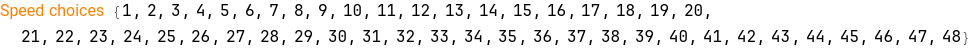

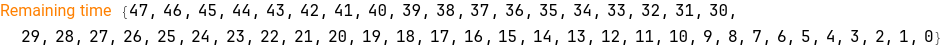

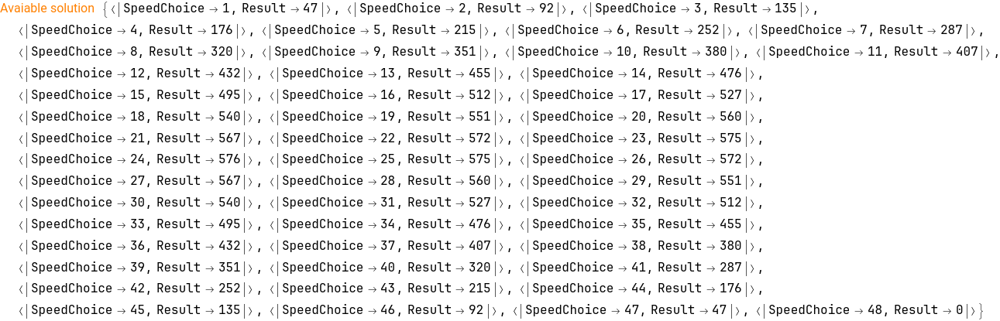

```
(*0*)
```

```mathematica
findPossibleSolution /@ ({#["Time"], #["Distance"]} & /@ inputParse) // Fold[Times, #] & // QuietEcho

(*4568778*)
```

```mathematica

```

## Part 2

Typical case of average algorithm problems, try to make the involve argument as much as big as possible

```mathematica
inputParse2 = ToExpression /@ (StringJoin /@ (StringCases[#, RegularExpression["\\d+"]] & @input // Partition[#, 4] &))

(*{48989083, 390110311121360}*)
```

```mathematica
findPossibleSolution[inputParse2] // QuietEcho (* Memory suffered*)
```

Let go back, try the pattern of result and input in part 1

```mathematica

```

```mathematica
findPossibleSolution /@ ({#["Time"], #["Distance"]} & /@ inputParse) // QuietEcho

(*{27, 73, 61, 38}*)
```

```mathematica
inputParse

(*{<|"Time" -> 48, "Distance" -> 390|>, <|"Time" -> 98, "Distance" -> 1103|>, <|"Time" -> 90, "Distance" -> 1112|>, <|"Time" -> 83, "Distance" -> 1360|>}*)
```

Let me see, I forget what name we should call this, ah single variable polynomial or something like that (I not good at math, so my name I give you may sound stupid, sorry folks 😆), a function that if we plot it will look like a mountain. Why, because I look at the distance pattern at part 1, it go up and down.  We have distance = remainingTime * speed, with remainingTime = (maximumTime - speed) . So we have function of single argument
d = (t - s)*s = $\text{st} - s{}^{\wedge}2$.  
t (maximum time) is independent.
s (speed) from 0 to maximum time.


```mathematica
Plot[-s^2 + s* 48989083, {s, 0, 48989083}, AxesLabel -> {"Speed", "Distance"}]
```

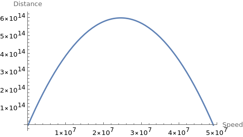

It not hard to guest, what we find is 2 point of speed axis that wrap the area where the curve go beyond the required distance, like this:

```mathematica
Show[Plot[-s^2 + s* 48989083, {s, 0, 48989083}, AxesLabel -> {"Speed", "Distance"}], 
  Epilog -> Line[{{0, inputParse2[[2]]}, {inputParse2[[2]], inputParse2[[2]]}}]]

```

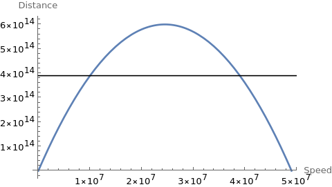

d = st - $s{}^{\wedge}2 \Leftrightarrow$48989083 * s - $s^2 -$390110311121360 = 0

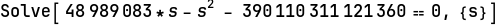

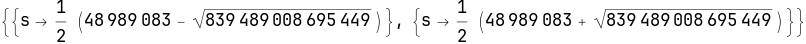

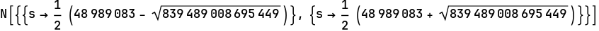

```
(*{{s -> 1.00076*10^7}, {s -> 3.89815*10^7}}*)
```

Hum, did I go wrong?, this numbers is so big, let check with smaller numbers of part 1.

```mathematica
inputParse[[1]]

(*<|"Time" -> 48, "Distance" -> 390|>*)
```

```mathematica
Solve[48*s - s^2  - 390 == 0, {s}]
```

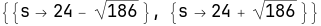

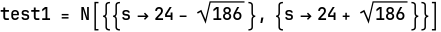

```
(*{{s -> 10.3618}, {s -> 37.6382}}*)
```

```mathematica

```

Okie, from 10.3 to 37.6 we have 27 integer numbers, that corrected. Let find a function that can extract only integers

```mathematica
Values[test1] // Flatten // #[[2]] - #[[1]] & // IntegerPart[#] &

(*27*)
```

```mathematica
IntegerPart[27.2764]

(*27*)
```

Okie, let use this method

```mathematica

```

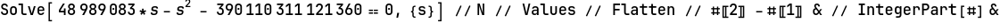

```
(*28973936*)
```

Correct!, thank you for reading

## Scratchpad

```mathematica
SetDirectory["~/nhannht-projects/aoc2023"]

(*"/home/vermin/nhannht-projects/aoc2023"*)
```
