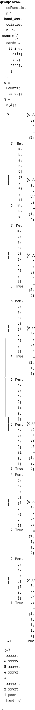

```mathematica
hands =  <|"card" -> StringTake[#, {1, 5}], 
      "bid" -> (StringCases[#, RegularExpression["\\s\\d+$"]] // First // ToExpression)|> & /@ StringSplit[input, "\n"] ;
```

```mathematica
hands // Short
```


Now we apply 2 layer of parse, first layer will grouping those hands to 7 difference groups base on what kind of cards they have. Second layer will sort them by compare each character. Seem easy, let 's see. We have at least 3 functions relative to "Grouping" a collections of element here. SplitBy, GroupBy, GatherBy 😓. If I checked the document correctly, they nearly the same about input, the difference is  SplitBy only apply compare to adj elements, GroupBy produce the result as a association with the key as f[x] (with f is conditional function), values is group of results. Gather will only produce the list of  group result.


```mathematica
handsGroup = SortBy[GroupBy[hands, hand |-> handGroupingFunction[hand]], Keys[#][[1]] &];
```

```mathematica
handsGroup // Keys

(*{1, 2, 3, 4, 5, 6, 7}*)
```

```mathematica
MapThread[<|"number of hands" -> #1, "type" -> #2|> &, {Length[handsGroup[#]] & /@  Keys[handsGroup], Keys[handsGroup]} ]


(*{<|"number of hands" -> 214, "type" -> 1|>, <|"number of hands" -> 260, "type" -> 2|>, <|"number of hands" -> 160, "type" -> 3|>, <|"number of hands" -> 175, "type" -> 4|>, <|"number of hands" -> 89, "type" -> 5|>, <|"number of hands" -> 101, "type" -> 6|>, <|"number of hands" -> 1, "type" -> 7|>}*)
```

Now sort each group by character

Oh sorry, so we have a rule here, we not simply comparing by alphabet value of them


Another question rose here, what is the definition of bigger, equal and less than, how Sorting actually work . There is no official document to teach me about how to write a comparing function in Wolfram language . If I remember correctly, in Python, a custom comparing function will return  {-1, 0, 1} when compare 2 element. But in Wolfram, think is not like this. Base on this document.


Wolfram compare thing in the context of numerical, the custom function p, if apply, its job is like a converter, not a compare-one .It didn't return True or False, 0 or 1. But return a numerical value which used to pick suitable position on the sort result.

```mathematica
convertHandToValue[hand_String] := Module[{
    card = StringSplit[hand, ""], 
    cardValues = {"A" -> 13, "K" -> 12, "Q" -> 11, "J" -> 10, "T" -> 9, "9" -> 8, "8" -> 7, "7" -> 6, "6" -> 5, "5" -> 4, "4" -> 3, "3" -> 2, "2" -> 1} 
   }, 
   cardNumbers = card /. cardValues; 
   (#[[1]] * 10^4 + #[[2]]* 10^3 + #[[3]]*10^2 + #[[4]]*10^1 + #[[5]] ) & @ cardNumbers 
  ]
```

```mathematica
SortBy[handsGroup[1], hand |-> convertHandToValue[hand["card"]]] // Short[#, 10] &
```


Nice .

```mathematica

```

```mathematica
handsWithRank = MapThread[<|"card" -> #1[["card"]], "bid" -> #1[["bid"]], "rank" -> #2|> & , {Values[SortBy[#, ( hand |-> convertHandToValue[hand["card"]])] & /@ handsGroup ] // Flatten, Range[Length[hands]]}]
```


```mathematica
#["rank"]* #["bid"] & /@ handsWithRank // Total

(*247839006*)
```

Wow, wow, wow, surprise, I think everything work perfectly, but the results is wrong. 😆

It took me 45 minutes just to realize apply the weight of 10^n to each card is wrong. Because it will get corrupted. It just my feeling, I still not sure the mathematic reason about it. Actually, we can only obtain correct result when n >= 13. 13 is the number of type of card from A down to 2. But what is reason that why only >= 13  the right way? 

```mathematica
convertHandToValue[hand_String] := Module[{
    card = StringSplit[hand, ""], 
    cardValues = {"A" -> 13, "K" -> 12, "Q" -> 11, "J" -> 10, "T" -> 9, "9" -> 8, "8" -> 7, "7" -> 6, "6" -> 5, "5" -> 4, "4" -> 3, "3" -> 2, "2" -> 1} 
   }, 
   cardNumbers = card /. cardValues; 
   (#[[1]] * 13^4 + #[[2]]* 13^3 + #[[3]]*13^2 + #[[4]]*13^1 + #[[5]] ) & @ cardNumbers 
  ]
```

```mathematica
handsWithRank = MapThread[<|"card" -> #1[["card"]], "bid" -> #1[["bid"]], "rank" -> #2|> & , {Values[SortBy[#, ( hand |-> convertHandToValue[hand["card"]])] & /@ handsGroup ] // Flatten, Range[Length[hands]]}]
```


```mathematica
#["rank"]* #["bid"] & /@ handsWithRank // Total

(*247815719*)
```

Corrected

I still counted as losing in this problem, because I didn't' t understand why >= 13 give me correct result 😓 . I will back to check it later

## Side note

It took me a while after finish part 2 and go back, try to make my head clear  why n >=13 work. From the start, I pick n = 10 and entire function firstNum * 10^4+... +firstNum is simple... unconscious. I just have a feeling that this path will yield the results, my logic is that each will give weight to each card/position. but it simply not enough, why I pick 10. This is the problem, why not pick 2 or anything else. Now I remembered, this pattern did came from the method that convert a binary to decimal form. 😂

Example:


Not hard to understand why we pick n = 13 (I think n > 13 worked is simply random in our case, But n =13 is surely work). Because our problem actually is convert a value in form of 13 digit systems to decimal (10 digits system) 

To go deeper a bit, anyone used to learn some 101 course about computer science in university (hum, not me). Or read text book (I actually obtain this experience from the text book, I remember that book name "Code:...", it [here](https://www.amazon.com/Code-Language-Computer-Hardware-Software/dp/0137909101/ref=sr_1_6?crid=14GBL5RYFIE9B&keywords=computer+book&qid=1701977928&sprefix=computer+boo%2Caps%2C339&sr=8-6), we will know that human have way to convert the between two type of numbers, binary and decimal. 2 questions will rose here:

1.Why these methods work?
2. More important, why we need these methods? 

Well, I still not know the answer of the first, so I will focus on the second. Most of the answers will be... because computer using binary, not decimal form of number, ... hum, seem acceptable, but bold, because I am human, why I need to care about computer. 

 I try to go more generalize, human perspective always recognize the definition of values, even before they invent number system, we always try to give "something" a value on its own. But the problems is, different people, and context, and culture, civilizations will have difference way to "value" everything. That why we need, always need, try to find ways to convert a values from "context A" to a value in "context B". I think, even the sins humanity have no  boundary, at least these method will help us lower the percent of... ah, uh, dumb-ism actions. 

```mathematica

```

## Part 2


😂 . god, he know how to make thing more messy.  Let we write the rule out here to make clear of our mind. We have 2 new rules: 

First, in grouping phase, if  J cards exist will "count themself as" other type of card (character) how try make  hands that holding them increase to highest rank as much as possible.  The only exception as JJJJJ. Like the tree of logic we implement in Part1 will growing more branches

Second, in ranking phase . "J" is itself, and act as lowest value card. This is easier. 

Let 's implements. I actually rewrote the below code 2 times, change the way to implement the logic from checking number of J first -> split the branch  based on the init cards count 



```mathematica
handsGroupWithJoker = SortBy[GroupBy[hands, hand |-> groupinPhaseFunction[hand]] , Keys[#][[1]] &];
```

```mathematica
convertHandToValueWithJoker[hand_String] := Module[{
    card = StringSplit[hand, ""], 
    cardValues = MapThread[#1 -> #2 &, {{"A", "K", "Q", "T", "9", "8", "7", "6", "5", "4", "3", "2", "J"}, Range[13, 1, -1]}] 
   }, 
   cardNumbers = card /. cardValues; 
   (#[[1]] * 13^4 + #[[2]]* 13^3 + #[[3]]*13^2 + #[[4]]*13^1 + #[[5]] ) & @ cardNumbers 
  ]
```

```mathematica
handsWithRank2 = MapThread[<|"card" -> #1[["card"]], "bid" -> #1[["bid"]], "rank" -> #2|> & , {Values[SortBy[#, ( hand |-> convertHandToValueWithJoker[hand["card"]])] & /@ handsGroupWithJoker ] // Flatten, Range[Length[hands]]}]
```


```mathematica
#["rank"]* #["bid"] & /@ handsWithRank2 // Total

(*248747492*)
```

## Scratchpad

```mathematica
SetDirectory["~/nhannht-projects/aoc2023"]

(*"/home/vermin/nhannht-projects/aoc2023"*)
```

```mathematica
Select[<|"B" -> 1, "A" -> 2, "J" -> 2|>, # == Max[<|"B" -> 1, "A" -> 2, "J" -> 2|>] &]

(*<|"A" -> 2, "J" -> 2|>*)
```

```mathematica
(KeySelect[<|"A" -> 2|>, # == "J" &] // Length) == 0

(*True*)
```

```mathematica
<|"B" -> 1, "A" -> 2, "J" -> 2|>

(*<|"B" -> 1, "A" -> 2, "J" -> 2|>*)
```

```mathematica
j = <|"B" -> 1, "A" -> 2|>["J"] 

(*Missing["KeyAbsent", "J"]*)
```

```mathematica
MissingQ[j]

(*True*)
```

```mathematica
<|"B" -> 1, "A" -> 2|>["J"]

(*Missing["KeyAbsent", "J"]*)
```

```mathematica
MissingQ [Missing["KeyAbsent", "J"]]

(*True*)
```

```mathematica
<|"B" -> 1, "A" -> 2, "J" -> 2|>[["B"]] = 2
```


```
(*2*)
```

```mathematica
KeySelect[<|"B" -> 1, "A" -> 2, "J" -> 2|>, # == "J" &]

(*<|"J" -> 2|>*)
```

```mathematica
<|"B" -> 1, "A" -> 2, "J" -> 2|> // Keys

(*{"B", "A", "J"}*)
```

```mathematica

```

```mathematica
inputExample = "32T3K 765T55J5 684KK677 28KTJJT 220QQQJA 483";
```

```mathematica
handExample = <|"card" -> StringTake[#, {1, 5}], 
     "bid" -> (StringCases[#, RegularExpression["\\s\\d+$"]] // First // ToExpression)|> & /@ StringSplit[inputExample, "\n"] 

(*{<|"card" -> "32T3K", "bid" -> 765|>, <|"card" -> "T55J5", "bid" -> 684|>, <|"card" -> "KK677", "bid" -> 28|>, <|"card" -> "KTJJT", "bid" -> 220|>, <|"card" -> "QQQJA", "bid" -> 483|>}*)
```

```mathematica
handsGroupExample =  SortBy[GroupBy[handExample, hand |-> handGroupingFunction[hand]], Keys]

(*<|2 -> {<|"card" -> "32T3K", "bid" -> 765|>}, 3 -> {<|"card" -> "KK677", "bid" -> 28|>, <|"card" -> "KTJJT", "bid" -> 220|>}, 4 -> {<|"card" -> "T55J5", "bid" -> 684|>, <|"card" -> "QQQJA", "bid" -> 483|>}|>*)
```

```mathematica
handsGroupExampleWithJoker = SortBy[GroupBy[handExample, hand |-> groupinPhaseFunction[hand]], Keys]

(*<|2 -> {<|"card" -> "32T3K", "bid" -> 765|>}, 3 -> {<|"card" -> "KK677", "bid" -> 28|>}, 6 -> {<|"card" -> "T55J5", "bid" -> 684|>, <|"card" -> "KTJJT", "bid" -> 220|>, <|"card" -> "QQQJA", "bid" -> 483|>}|>*)
```

```mathematica
handsWithRankExample = MapThread[<|"card" -> #1[["card"]], "bid" -> #1[["bid"]], "rank" -> #2|> & , {Values[SortBy[#, ( hand |-> convertHandToValue[hand["card"]])] & /@ handsGroupExample ] // Flatten, Range[Length[handExample]]}]

(*{<|"card" -> "32T3K", "bid" -> 765, "rank" -> 1|>, <|"card" -> "KTJJT", "bid" -> 220, "rank" -> 2|>, <|"card" -> "KK677", "bid" -> 28, "rank" -> 3|>, <|"card" -> "T55J5", "bid" -> 684, "rank" -> 4|>, <|"card" -> "QQQJA", "bid" -> 483, "rank" -> 5|>}*)
```

```mathematica
handsWithRankExampleWithJoker = MapThread[<|"card" -> #1[["card"]], "bid" -> #1[["bid"]], "rank" -> #2|> & , {Values[SortBy[#, ( hand |-> convertHandToValueWithJoker[hand["card"]])] & /@ handsGroupExampleWithJoker ] // Flatten, Range[Length[handExample]]}]

(*{<|"card" -> "32T3K", "bid" -> 765, "rank" -> 1|>, <|"card" -> "KK677", "bid" -> 28, "rank" -> 2|>, <|"card" -> "T55J5", "bid" -> 684, "rank" -> 3|>, <|"card" -> "QQQJA", "bid" -> 483, "rank" -> 4|>, <|"card" -> "KTJJT", "bid" -> 220, "rank" -> 5|>}*)
```

```mathematica
#["rank"]* #["bid"] & /@ handsWithRankExample // Total

(*6440*)
```

```mathematica
#["rank"]* #["bid"] & /@ handsWithRankExampleWithJoker // Total

(*5905*)
```
