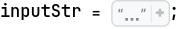
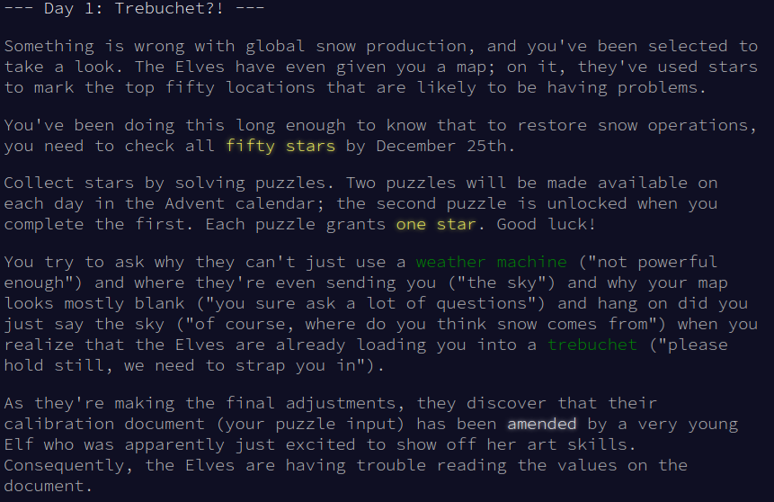

#### Convert the input string to list of string, each line is a element

```mathematica
inputList = StringTrim /@ StringSplit[inputStr, "\n"]  ;
```

```mathematica
inputList // Shallow

(*{"9vxfg", "19qdlpmdrxone7sevennine", "1dzntwofour9nineffck", "7bx8hpldgzqjheight", "joneseven2sseven64chvczzn", "seven82683", "7onefour1eighttwo5three", "8lmsk871eight7", "ninefivefive2nine5ntvscdfdsmvqgcbxxxt", "onepx6hbgdssfivexs", <<990>>}*)
```

#### Part 1:Extract Number -> join them -> Take first and last -> Convert to number -> Total

```mathematica
part1Solution[listOfString_List] := Total[ToExpression /@ StringJoin /@ (Part[#, {1, -1}] & /@ ( StringCases[#, DigitCharacter] & /@ listOfString   )  )  ]
```

```mathematica
part1Solution[inputList]

(*54390*)
```

#### Part 2 : Convert string to number base on real pattern -> Reuse part 1

```mathematica
patternList = {
    "one" -> "1", 
    "two" -> "2", 
    "three" -> "3", 
    "four" -> "4", 
    "five" -> "5", 
    "six" -> "6", 
    "seven" -> "7", 
    "eight" -> "8", 
    "nine" -> "9"};
```

```mathematica
StringReplace[inputList, patternList] ;
```

```mathematica
part1Solution[%]

(*54305*)
```

*Wrong solution, 🤣 the problem is that I am so naive to think a simple replace strategy will work, the pair of nine-eight or three-eight or one-eight will be corrupt if I mere replace like that
In form of data computation, it situation similar like amateur data handle. Were poor algorithm will break entire chain of data.
In form of human linguistic, make me think about how human so smart when creating a compact and unique symbols just to handle number* 

#### Let try other way

Instead of mere replace, I remember Python regex search can return the list of all position that matching pattern, I don't think Wolfram language different in this ways to search pattern, we surely have a function that can find all the position that match, and, if nice, include the matched ones

```mathematica
StringTake ["19qdlpmdrxone7sevennine", #] & /@ StringPosition["19qdlpmdrxone7sevennine", Union[{DigitCharacter}, Keys[patternList]]]

(*{"1", "9", "one", "7", "seven", "nine"}*)
```

Perfect, this is all I want

```mathematica
extractCharacter[str_String] := StringTake [str, #] & /@ StringPosition[str, Union[{DigitCharacter}, Keys[patternList]]]
```

Let see : extract number pattern -> replace word numbers with real digit -> extract first and last -> join these pair as string  ->  total

```mathematica
Total @ (ToExpression /@ (StringJoin /@ ( Part [#, {1, -1}] & /@ ( extractCharacter /@ inputList) /. patternList )  ))

(*54277*)
```

## Notes:

This is the first time I use Wolfram to solve AoC 😆, the most fun of AOC is that the designer of these problems is really genius, he can design those problem in the most 🤯 creative way, more and more  abstraction layers appear when you deep dive into his works. Anyway, hope you fun with me buddies

## Content:

[See here](https://adventofcode.com/2023/day/1)



## Scratchpad

```mathematica
SetDirectory["~/nhannht-projects/aoc2023/"];
```

```mathematica
exampleInputStringList = {"two1nine", "eightwothree", "abcone2threexyz", "xtwone3four", "4nineeightseven2", "zoneight234","7pqrstsixteen"}
```

```mathematica
part1Solution[StringReplace[#, patternList] & /@ exampleInputStringList ]

(*281*)
```

```mathematica
Part[{}, {1, -1}]
```


```
(*{}[[{1, -1}]]*)
```

```mathematica
StringReplace["eightwothree", patternList]

(*"*8*wo*3*"*)
```

```mathematica
StringCases["9999123ffdscf2342362342", DigitCharacter]
```

```mathematica
{"9", "9", "9", "9", "1", "2", "3", "2", "3", "4", "2", "3", "6", "2","3", "4", "2"} // Length

(*17*)
```

```mathematica
StringReplaceList["eighteightsrfcxtvg7three1two9nineeightwolqn", patternList]

(*{"*8*eightsrfcxtvg7three1two9nineeightwolqn", "eight*8*srfcxtvg7three1two9nineeightwolqn", "eighteightsrfcxtvg7*3*1two9nineeightwolqn", "eighteightsrfcxtvg7three1*2*9nineeightwolqn", "eighteightsrfcxtvg7three1two9*9*eightwolqn", "eighteightsrfcxtvg7three1two9nine*8*wolqn", "eighteightsrfcxtvg7three1two9nineeigh*2*lqn"}*)
```
