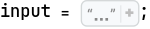
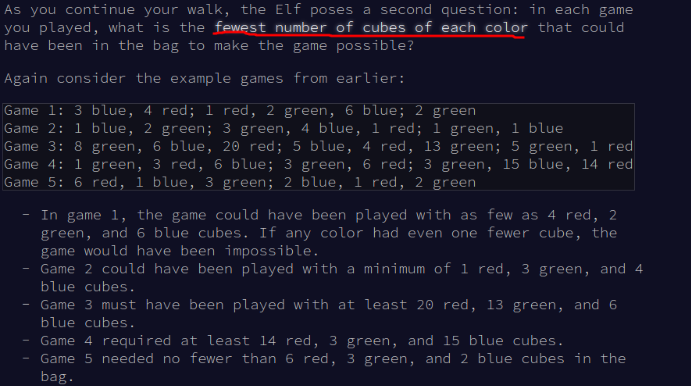

```mathematica
inputList = StringSplit[input, "\n"];
```

```mathematica
inputList // Shallow

(*{"Game 1: 18 red, 8 green, 7 blue; 15 red, 4 blue, 1 green; 2 green, 17 red, 6 blue; 5 green, 1 blue, 11 red; 18 red, 1 green, 14 blue; 8 blue", "Game 2: 16 blue, 12 green, 3 red; 13 blue, 2 red, 8 green; 15 green, 3 red, 16 blue", "Game 3: 6 green, 15 red; 1 green, 4 red, 7 blue; 9 blue, 7 red, 8 green", "Game 4: 8 red, 2 blue; 11 red, 5 blue, 1 green; 12 red, 1 green, 5 blue; 1 blue; 2 blue, 9 red", "Game 5: 9 blue, 3 red, 12 green; 3 green, 4 red, 17 blue; 15 blue, 2 green, 5 red; 3 blue, 5 green, 6 red; 6 red, 4 blue, 7 green; 3 green, 10 blue", "Game 6: 11 red, 2 blue, 6 green; 2 blue, 9 red, 4 green; 3 blue, 12 red, 8 green; 5 red, 11 green, 4 blue; 2 blue, 9 red, 13 green; 15 red, 3 blue, 7 green", "Game 7: 2 red, 9 green, 12 blue; 14 blue, 1 green, 6 red; 7 blue, 9 green; 9 green, 8 red, 4 blue; 5 red, 3 green, 16 blue; 4 red, 8 green", "Game 8: 11 red, 12 green, 1 blue; 4 red, 7 green; 11 red, 6 green; 17 green; 15 green, 1 red", "Game 9: 1 red, 1 green, 12 blue; 3 green, 12 red, 6 blue; 14 red, 1 blue; 9 blue, 1 red, 3 green", "Game 10: 1 red, 4 blue; 3 blue, 4 green; 3 green, 3 red, 8 blue; 2 blue, 3 red; 3 green, 4 red, 3 blue", <<90>>}*)
```

## part 1

```mathematica
parseInput[game_String] := Module[{g = game, 
     index = ToExpression /@ StringCases[game, RegularExpression["Game (\\d+):"] -> "$1"], 
     red = ToExpression /@ StringCases[game, RegularExpression["(\\d+) red"] -> "$1"], 
     green = ToExpression /@ StringCases[game, RegularExpression["(\\d+) green"] -> "$1"], 
     blue = ToExpression /@ StringCases[game, RegularExpression["(\\d+) blue"] -> "$1"] 
    }, 
    <|"index" -> Total@ index, "red" -> red, "green" ->  green, "blue" -> blue|> 
   ];
```

```mathematica
inputListParse = parseInput /@ inputList; 
```

```mathematica
redMustSmallerEqual12[x_List] := AllTrue[x, # <= 12 &];
greenMustSmallerEqual13[x_List] := AllTrue[x, # <= 13 &];
blueMustSmallerEqual14[x_List] := AllTrue[x, # <= 14 &];
```

```mathematica
suitableGames = Select[inputListParse, redMustSmallerThan12[#["red"]] 
      && greenMustSmallerEqual13[#["green"]] 
      && blueMustSmallerEqual14[#["blue"]] 
     &] ;
```

```mathematica
suitableGames // Shallow

(*{}*)
```

```mathematica
#["index"] & /@ suitableGames // Total

(*0*)
```

To be honest, after I solve this part 1, I still not understand what the hell the "game" that Else is playing is, this is one of limitation of AoC, even the author try to make his description as long as possible, the context is still small, the limit in power of human natural language make us hard to understand what he try to describe. All I do is grab key sentences with example and guess what he want me to do.

## Part 2

```mathematica
powerOfMeanInEachColor[game_Association] := Module[
   {maxRed = game["red"] // Max, 
    maxGreen = game["green"] // Max, 
    maxBlue = game["blue"] // Max 
   }, 
   maxRed * maxGreen * maxBlue 
  ]
```

```mathematica
Total[powerOfMeanInEachColor /@ inputListParse ]

(*71585*)
```




The hell! I feel confused why **fewest** but he pick max in each set. (´･_･`). But anyway this results is corrected. 🤣

## Scratchpad

```mathematica
SetDirectory["~/nhannht-projects/aoc2023/"];
```

```mathematica
# >= 15 & /@ {18, 15, 17, 11, 18}

(*{True, True, True, False, True}*)
```

```mathematica
True && False

(*False*)
```

```mathematica
Fold[And, {True, True, True, False, True}]

(*False*)
```

```mathematica
inputListParse[[1]]

(*<|"index" -> 1, "red" -> {18, 15, 17, 11, 18}, "green" -> {8, 1, 2, 5, 1}, "blue" -> {7, 4, 6, 1, 14, 8}|>*)
```

