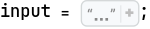
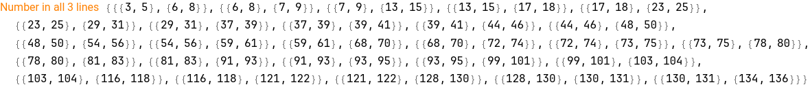
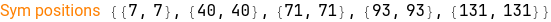
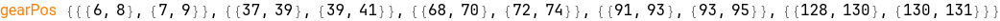
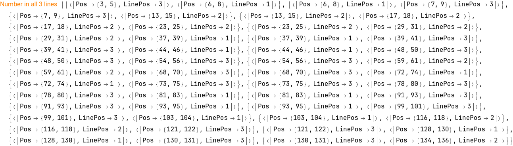
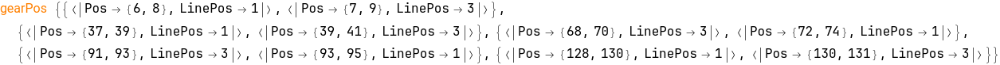
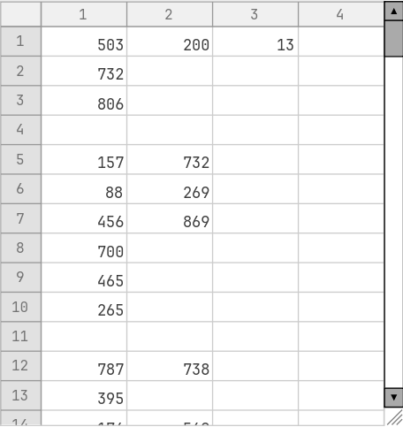

```mathematica
inputList = StringSplit[input, "\n"];
```

```mathematica
inputList // Length

(*140*)
```

## Part 1

```mathematica
symbolsPosition[str_String] := StringPosition[str, RegularExpression["[^a-zA-Z0-9.\\n]"]]
```

```mathematica
numberPosition[str_String] := StringPosition[str, RegularExpression["\\d+"], Overlaps -> False]
```

```mathematica
numberPosition[inputList[[1]]]

(*{{6, 8}, {37, 39}, {44, 46}, {72, 74}, {81, 83}, {93, 95}, {103, 104}, {128, 130}}*)
```

```mathematica
numberSuitableQ[numPos_List, symPos_List] := If[symPos[[1]] >= numPos[[1]] - 1 && symPos[[2]] <= numPos[[2]] + 1, numPos, False] (* compare two position list {a,b} with {c,d}, not a list of list*)
```

```mathematica

```

```mathematica
filterSuitableNumber[lineIndex_Integer, inList_List] := Module[{
    line = inList[[lineIndex]], 
    previousLine = If[lineIndex == 1, StringRepeat[".", StringLength[inList[[1]]]], inList[[lineIndex - 1]]], 
    nextLine = If[lineIndex == Length[inList], StringRepeat[".", StringLength[inList[[1]]]], inList[[lineIndex + 1]]] 
   }, 
   symbolsPosInAllThreeLine = (symbolsPosition /@ {line, previousLine,nextLine}) // Flatten[#, 1] &; 
   numberPosInMiddleLine = numberPosition[line]; 
   suitableNumPos = (Table[numberSuitableQ[numberPosInMiddleLine[[i]], symbolsPosInAllThreeLine[[j]]], {i, Range[Length[numberPosInMiddleLine]]}, 
        {j, Range[Length[symbolsPosInAllThreeLine]]}] // Flatten[#, 1] & ) // Select[#, x |-> ListQ[x]] &; 
   ToExpression /@ StringTake[line, suitableNumPos] 
  ]

```

```mathematica
filterSuitableNumber[2]

(*filterSuitableNumber[2]*)
```

Okie alright, finally, everything go to the point I start to lose what I am doing 🤣

```mathematica
filterSuitableNumber[#, inputList] & /@ Range[Length[inputList]] // Flatten // Total

(*507214*)
```

Wow, after a night my head is clearer, the problem is the from the start, I expect StringCases and StringPosition must work as the same with same pattern of RegularExpression, but StringPosition is not support grouping select in regex like the others. That why I used trick to pipe results from StringCases to StringPosition, lead to unexpected data corrupted (because that trick lead to overlap between single and multi digit number position). Instead that, StringPosition support Overlap option, turn it to False and everything will be easy. 

## Part 2

very the same with the first, but we need ensure each symbol must satisfy 2 (use && logic) number pos at one. 

```mathematica
numberPosition[inputList[[#]]] & /@ {1, 2, 3}  // Flatten[#, 1] & // Sort // Partition[#, 2, 1] &

(*{{{3, 5}, {6, 8}}, {{6, 8}, {7, 9}}, {{7, 9}, {13, 15}}, {{13, 15}, {17, 18}}, {{17, 18}, {23, 25}}, {{23, 25}, {29, 31}}, {{29, 31}, {37, 39}}, {{37, 39}, {39, 41}}, {{39, 41}, {44, 46}}, {{44, 46}, {48, 50}}, {{48, 50}, {54, 56}}, {{54, 56}, {59, 61}}, {{59, 61}, {68, 70}}, {{68, 70}, {72, 74}}, {{72, 74}, {73, 75}}, {{73, 75}, {78, 80}}, {{78, 80}, {81, 83}}, {{81, 83}, {91, 93}}, {{91, 93}, {93, 95}}, {{93, 95}, {99, 101}}, {{99, 101}, {103, 104}}, {{103, 104}, {116, 118}}, {{116, 118}, {121, 122}}, {{121, 122}, {128, 130}}, {{128, 130}, {130, 131}}, {{130, 131}, {134, 136}}}*)
```

```mathematica
gearSuitableQ[pairNumPos_List, symPos_List] := Module[{
    firstNumberPos = pairNumPos[[1]], 
    secondNumberPos = pairNumPos[[2]] 
    
   }, 
   If [symPos[[1]]  >= firstNumberPos[[1]] - 1 
     && symPos[[2]] <= firstNumberPos[[2]] + 1 
     && symPos[[1]] >= secondNumberPos[[1]] - 1 
     && symPos[[2]] <= secondNumberPos[[2]] + 1, 
    {firstNumberPos, secondNumberPos}, 
    False 
   ] 
  ](* compare pair of position of two number and the position of sympol*)
```

Okie, we can see the strategy here is the reverser of the part 1, instead compare number pos with symbol pos in near 3 line, we do the opposite

```mathematica
filterSuitableGear[lineIndex_Integer, inList_List] := Module[{
    line = inList[[lineIndex]], 
    previousLine = If[lineIndex == 1, StringRepeat[".", StringLength[inList[[1]]]], inList[[lineIndex - 1]]], 
    nextLine = If[lineIndex == Length[inList], StringRepeat[".", StringLength[inList[[1]]]], inList[[lineIndex + 1]]] 
   }, 
   numPosInAllThreeLine = (numberPosition /@ {line, previousLine, nextLine}) // Flatten[#, 1] & // Sort // Partition[#, 2, 1] &; 
   Echo[numPosInAllThreeLine, "Number in all 3 lines"]; 
   symPosInMiddleLine = symbolsPosition[line]; 
   Echo[symPosInMiddleLine, "Sym positions"]; 
   suitableGearPos = (Table[gearSuitableQ[numPosInAllThreeLine[[i]], symPosInMiddleLine[[j]]], {i, Range[Length[numPosInAllThreeLine]]}, 
        {j, Range[Length[symPosInMiddleLine]]}] // Flatten[#, 1] & ) //Select[#, x |-> ListQ[x]] &; 
   Echo[suitableGearPos, "gearPos"]; 
   suitableGearPos 
  ]
```

```mathematica
filterSuitableGear[2, inputList]
```







```
(*{{{6, 8}, {7, 9}}, {{37, 39}, {39, 41}}, {{68, 70}, {72, 74}}, {{91, 93}, {93, 95}}, {{128, 130}, {130, 131}}}*)
```

The problem raised here, because the numbers need scattered across 3 lines, we need to ensure extract correct each of them. May be we need to remodel our data

```mathematica
a =  numberPosition[inputList[[#]]] & /@ {1, 2, 3} // Flatten[#, 1] & // Sort  // Partition[#, 2, 1] &

(*{{{3, 5}, {6, 8}}, {{6, 8}, {7, 9}}, {{7, 9}, {13, 15}}, {{13, 15}, {17, 18}}, {{17, 18}, {23, 25}}, {{23, 25}, {29, 31}}, {{29, 31}, {37, 39}}, {{37, 39}, {39, 41}}, {{39, 41}, {44, 46}}, {{44, 46}, {48, 50}}, {{48, 50}, {54, 56}}, {{54, 56}, {59, 61}}, {{59, 61}, {68, 70}}, {{68, 70}, {72, 74}}, {{72, 74}, {73, 75}}, {{73, 75}, {78, 80}}, {{78, 80}, {81, 83}}, {{81, 83}, {91, 93}}, {{91, 93}, {93, 95}}, {{93, 95}, {99, 101}}, {{99, 101}, {103, 104}}, {{103, 104}, {116, 118}}, {{116, 118}, {121, 122}}, {{121, 122}, {128, 130}}, {{128, 130}, {130, 131}}, {{130, 131}, {134, 136}}}*)
```

```mathematica
b = symbolsPosition[inputList[[2]]]

(*{{7, 7}, {40, 40}, {71, 71}, {93, 93}, {131, 131}}*)
```

```mathematica
gearSuitableQ[a[[2]], b[[1]]]

(*{{6, 8}, {7, 9}}*)
```

```mathematica
(Table[gearSuitableQ[a[[i]], b[[j]]], {i, Range[Length[a]]}, 
    {j, Range[Length[b]]}] // Flatten[#, 1] & ) 

(*{False, False, False, False, False, {{6, 8}, {7, 9}}, False, False, False, False, False, False, False, False, False, False, False, False, False, False, False, False, False, False, False, False, False, False, False, False, False, False, False, False, False, False, {{37, 39}, {39, 41}}, False, False, False, False, False, False, False, False, False, False, False, False, False, False, False, False, False, False, False, False, False, False, False, False, False, False, False, False, False, False, {{68, 70}, {72, 74}}, False, False, False, False, False, False, False, False, False, False, False, False, False, False, False, False, False, False, False, False, False, False, False, False, False, {{91, 93}, {93, 95}}, False, False, False, False, False, False, False, False, False, False, False, False, False, False, False, False, False, False, False, False, False, False, False, False, False, False, False, False, False, False, {{128, 130}, {130, 131}}, False, False, False, False, False}*)
```

```mathematica
numberPositionWithLineNum[str_String, lineNum_Integer] := <|"Pos" -> #, "LinePos" -> lineNum|> & /@ StringPosition[str, RegularExpression["\\d+"], Overlaps -> False]
```

```mathematica
numberPositionWithLineNum[inputList[[1]], 1]

(*{<|"Pos" -> {6, 8}, "LinePos" -> 1|>, <|"Pos" -> {37, 39}, "LinePos" -> 1|>, <|"Pos" -> {44, 46}, "LinePos" -> 1|>, <|"Pos" -> {72, 74}, "LinePos" -> 1|>, <|"Pos" -> {81, 83}, "LinePos" -> 1|>, <|"Pos" -> {93, 95}, "LinePos" -> 1|>, <|"Pos" -> {103, 104}, "LinePos" -> 1|>, <|"Pos" -> {128, 130}, "LinePos" -> 1|>}*)
```

Yeah, fix our core function

```mathematica
gearSuitableQ[pairNumPos_List, symPos_List] := Module[{
    firstNumberPos = pairNumPos[[1]]["Pos"], 
    secondNumberPos = pairNumPos[[2]]["Pos"] 
   }, 
   If [symPos[[1]]  >= firstNumberPos[[1]] - 1 
     && symPos[[2]] <= firstNumberPos[[2]] + 1 
     && symPos[[1]] >= secondNumberPos[[1]] - 1 
     && symPos[[2]] <= secondNumberPos[[2]] + 1, 
    pairNumPos, 
    False 
   ] 
  ]
```

```mathematica
filterSuitableGear[lineIndex_Integer, inList_List] := Module[{
    line = inList[[lineIndex]], 
    numLine = numberPositionWithLineNum[inList[[lineIndex]], lineIndex], 
    previousLine = If[lineIndex == 1, StringRepeat[".", StringLength[inList[[1]]]], inList[[lineIndex - 1]]], 
    numPrevLine = If[lineIndex == 1, {}, numberPositionWithLineNum[inList[[lineIndex - 1]], lineIndex - 1]], 
    nextLine = If[lineIndex == Length[inList], StringRepeat[".", StringLength[inList[[1]]]], inList[[lineIndex + 1]]], 
    numNextLine = If[lineIndex == Length[inList], {}, numberPositionWithLineNum[inList[[lineIndex + 1]], lineIndex + 1]] 
   }, 
   numPosInAllThreeLine = Join[numLine, numPrevLine, numNextLine] // SortBy[#, x |-> x["Pos"]] & // Partition[#, 2, 1] & ; 
   Echo[numPosInAllThreeLine, "Number in all 3 lines"]; 
   symPosInMiddleLine = symbolsPosition[line]; 
   Echo[symPosInMiddleLine, "Sym positions"]; 
   suitableGearPos = (Table[gearSuitableQ[numPosInAllThreeLine[[i]], symPosInMiddleLine[[j]]], {i, Range[Length[numPosInAllThreeLine]]}, 
        {j, Range[Length[symPosInMiddleLine]]}] // Flatten[#, 1] & ) //Select[#, x |-> ListQ[x]] &; 
   Echo[suitableGearPos, "gearPos"]; 
   (gear |-> ToExpression[StringTake[inList[[gear[[1]]["LinePos"]]], gear[[1]]["Pos"]]] * ToExpression[StringTake[inList[[gear[[2]]["LinePos"]]], gear[[2]]["Pos"]]]) /@ suitableGearPos // Total 
   
  ]
```

```mathematica
filterSuitableGear[2, inputList]
```






```
(*623330*)
```

```mathematica
filterSuitableGear[#, inputList] & /@ Range[Length[inputList]] // QuietEcho // Total

(*72553319*)
```

```mathematica

```

Oh mine, finally, this question supposed to be easy ones, right, but it took me so much time 😃

## Scratchpad

```mathematica
489*540

(*264060*)
```

```mathematica
FrontEndExecute@FrontEnd`AddMenuCommands["PlainFont", {MenuItem["Strikethrough", FrontEnd`FontVariationsStrikeThrough -> Toggle, System`MenuKey["u", System`Modifiers -> {"Command"}]]}]
```


There is something going wrong, look at {444, 428, 470, 128, 684, 399, 105, 680, 7, 7, 583, 53}, it nearly right but there is double 7 here, our algorithm produce repeated results, 

```mathematica
filterSuitableNumber[lineIndex_Integer, inList_List] := Module[{
    line = inList[[lineIndex]], 
    previousLine = If[lineIndex == 1, StringRepeat[".", StringLength[inList[[1]]]], inList[[lineIndex - 1]]], 
    nextLine = If[lineIndex == Length[inList], StringRepeat[".", StringLength[inList[[1]]]], inList[[lineIndex + 1]]] 
   }, 
   symbolsPosInAllThreeLine = (symbolsPosition /@ {line, previousLine,nextLine}) // Flatten[#, 1] &; 
   numberPosInMiddleLine = DeleteDuplicates@ numberPosition[line]; 
   suitableNumPos = (Table[numberSuitableQ[numberPosInMiddleLine[[i]], symbolsPosInAllThreeLine[[j]]], {i, Range[Length[numberPosInMiddleLine]]}, 
        {j, Range[Length[symbolsPosInAllThreeLine]]}] // Flatten[#, 1] & ) // Select[#, x |-> ListQ[x]] &; 
   ToExpression /@ StringTake[line, suitableNumPos] 
  ]
```

```mathematica
filterSuitableNumber[#, inputList] & /@ Range[Length[inputList]] // Flatten // Total

(*507214*)
```

Wrong again 😢, the result now lower instead of high, I guess, there is actually have duplicates that cannot be delete, that mean there is duplicate number that suitable in a same line, let check it

```mathematica
Tally /@ (x |-> StringCases[x, RegularExpression["\\d+"]])  /@ inputList // Flatten[#, 1] & // Select[#, #[[2]] != 1] &

(*{}*)
```

Strange, it mean no repeated number in each line, why it went wrong?

```mathematica
filterSuitableNumber[41, inputList]

(*{295, 803, 143, 395, 489}*)
```

```mathematica
exampleInput = "467..114.....*........35..633.......#...617*...........+.58...592...........755....$.*.....664.598..";
```

```mathematica
exampleInputList = StringSplit[exampleInput, "\n"];
```

```mathematica
filterSuitableNumber[1, exampleInputList]

(*{467}*)
```

```mathematica
Total[{{467}, "", {35, 633}, "", {617}, "", {592}, {755}, "", {664, 598}} // Flatten]

(*4361 + 4 ""*)
```

The example is correct, what happens/ oh my god

Let check all symbol .

```mathematica
DeleteDuplicates@StringCases[input, RegularExpression["[^a-zA-Z0-9.]"]]

(*{"", "*", "@", "=", "%", "+", "$", "&", "/", "-", "#"}*)
```

```mathematica
{"\n", "*", "@", "=", "%", "+", "$", "&", "/", "-", "#"} (* No problems*)

(*{"", "*", "@", "=", "%", "+", "$", "&", "/", "-", "#"}*)
```

Let do the opposite, if our result is too low, that mean we remove number more than needed, let ' s check all those number that was remove

```mathematica
allNumbers = Map[ToExpression, (StringCases[#, RegularExpression["\\d+"]] & /@ inputList ), {2}] ;
suitableNumbers = filterSuitableNumber[#, inputList] & /@ Range[Length[inputList]] ;
```

```mathematica
unsuitableNumber = 
  MapThread[Fold[DeleteCases[#1, #2, 1, 1] &, #1, #2] &, {allNumbers, suitableNumbers}]

(*{{503, 200, 13}, {732}, {806}, {}, {157, 732}, {88, 269}, {456, 869}, {700}, {465}, {265}, {}, {787, 738}, {395}, {176, 569}, {}, {400, 3}, {858, 679}, {876}, {}, {858}, {}, {787, 924}, {}, {738, 576}, {858}, {}, {}, {}, {}, {}, {440, 316}, {149}, {926, 951}, {}, {}, {285}, {974}, {371}, {606}, {}, {}, {752, 305}, {981}, {312}, {}, {}, {891}, {982}, {810, 694}, {462}, {}, {555, 477}, {40, 640, 340}, {220, 288}, {}, {793, 613, 754}, {741}, {5}, {252, 99}, {359}, {989, 922}, {}, {}, {365}, {527}, {869, 466}, {364}, {966, 647}, {}, {301,973}, {647, 877}, {328}, {}, {317}, {}, {865}, {258}, {510, 217, 431, 566}, {161}, {}, {}, {228, 122}, {}, {80}, {}, {726, 109, 760}, {384}, {623, 30}, {}, {413, 188}, {951}, {503, 395}, {}, {158}, {18, 382}, {138, 410}, {}, {24}, {734, 62}, {997}, {}, {769}, {812}, {611, 25}, {}, {866}, {252}, {418, 222}, {}, {100}, {203}, {498}, {75}, {}, {}, {}, {}, {865}, {}, {180}, {944, 996, 71}, {462, 27}, {55, 408}, {}, {108, 22, 721}, {332,454, 622}, {800, 600}, {847}, {174}, {864}, {287}, {156}, {}, {}, {766}, {408}, {}, {}, {223, 33}, {287, 958}}*)
```

```mathematica
TableView[%]
```



```mathematica
suitableNumbers[[103]]

(*{742, 554, 148, 727, 875, 857, 875}*)
```

```mathematica
symbolsPosition[inputList[[119]]]

(*{{9, 9}, {14, 14}, {31, 31}, {36, 36}, {51, 51}, {74, 74}, {91, 91}, {106, 106}, {131, 131}}*)
```

```mathematica
StringCases[inputList[[119]], RegularExpression["[^a-zA-Z0-9.\\n]?(\\d+)[^a-zA-Z0-9.\\n]?"] -> "$1"]

(*{"780", "996", "7", "855", "515", "990", "600", "765", "911"}*)
```

```mathematica
StringTake[inputList[[119]], StringPosition[inputList[[119]], RegularExpression["\\d+"], Overlaps -> False]]

(*{"780", "996", "7", "855", "515", "990", "600", "765", "911"}*)
```

```mathematica
numberPosition[inputList[[119]]]

(*{{22, 24}, {26, 28}, {62, 62}, {65, 67}, {70, 72}, {80, 82}, {100, 102}, {108, 110}, {123, 125}}*)
```

```mathematica
StringTake[inputList[[119]], numberPosition[inputList[[119]]]]

(*{"780", "996", "7", "855", "515", "990", "600", "765", "911"}*)
```

```mathematica
filterSuitableNumber[119, inputList]

(*{780, 996, 7, 855, 515, 990, 600, 765, 911}*)
```

```mathematica
filterSuitableNumber[136, inputList]

(*{914, 788, 660, 138, 333, 48, 380, 104}*)
```

```mathematica
numberPosition[inputList[[104]]]

(*{{4, 6}, {18, 20}, {22, 24}, {28, 30}, {60, 62}, {65, 67}, {69, 70}, {103, 105}, {126, 127}, {132, 134}, {136, 138}}*)
```

```mathematica
allNumbers[[103]]

(*{742, 554, 148, 812, 727, 875, 857, 875}*)
```

```mathematica
suitableNumbers // Flatten  // DeleteDuplicates // Total

(*322449*)
```

```mathematica
allNumbers // Flatten // Total

(*579596*)
```

```mathematica
(allNumbers // Flatten // Total) - (unsuitableNumber // Flatten  // Total)

(*507214*)
```

WTF, how it can be, why different in the result!!  

```mathematica
Fold[DeleteCases[#1, #2, 1, 1] &, {849, 136, 787, 787, 152, 187, 738, 85, 960, 749}, suitableNumbers[[12]]]

(*{787, 738}*)
```

```mathematica
suitableNumbers[[12]]

(*{849, 136, 787, 152, 187, 85, 960, 749}*)
```

```mathematica
allNumbers[[12]]

(*{849, 136, 787, 787, 152, 187, 738, 85, 960, 749}*)
```

```mathematica
StringCases[inputList[[12]], RegularExpression["\\d+"]]

(*{"849", "136", "787", "787", "152", "187", "738", "85", "960", "749"}*)
```

```mathematica
(StringPosition [inputList[[12]], #] & /@ StringCases[inputList[[12]], RegularExpression["\\d+"]] ) // Flatten[#, 1] &

(*{{3, 5}, {35, 37}, {46, 48}, {58, 60}, {46, 48}, {58, 60}, {68, 70}, {82, 84}, {95, 97}, {126, 127}, {130, 132}, {136, 138}}*)
```

```mathematica
StringPosition[inputList[[12]], RegularExpression["\\d+"]]

(*{{3, 5}, {4, 5}, {5, 5}, {35, 37}, {36, 37}, {37, 37}, {46, 48}, {47, 48}, {48, 48}, {58, 60}, {59, 60}, {60, 60}, {68, 70}, {69, 70}, {70, 70}, {82, 84}, {83, 84}, {84, 84}, {95, 97}, {96, 97}, {97, 97}, {126, 127}, {127, 127}, {130, 132}, {131, 132}, {132,132}, {136, 138}, {137, 138}, {138, 138}}*)
```

```mathematica

```

```mathematica
suitableNumbers[[7]]

(*{905, 74, 795, 128, 872, 521, 806, 93, 168}*)
```

God, I am lost, I have no idea my solution not right, everything look so perfect

```mathematica
StringPosition[inputList[[2]], RegularExpression["[0-9]+"]]

(*{{13, 15}, {14, 15}, {15, 15}, {17, 18}, {18, 18}, {23, 25}, {24, 25}, {25, 25}, {29, 31}, {30, 31}, {31, 31}, {59, 61}, {60, 61}, {61, 61}, {116, 118}, {117, 118}, {118, 118}, {134, 136}, {135,136}, {136, 136}}*)
```

 Hum, seem like StringCases and StringPosition work in different way with the same regex.

```mathematica
numberPosition[inputList[[10]]]

(*{{3, 4}, {8, 10}, {18, 20}, {47, 49}, {83, 85}, {89, 91}, {100, 102}, {111, 113}, {119, 121}, {127, 129}, {131, 133}, {135, 137}}*)
```

```mathematica
StringPosition[inputList[[2]], RegularExpression["[^a-zA-Z0-9.]"]]

(*{{7, 7}, {40, 40}, {71, 71}, {93, 93}, {131, 131}}*)
```

```mathematica
StringCases[inputList[[2]], RegularExpression["[0-9]+"]] 

(*{"186", "48", "681", "732", "935", "512", "874"}*)
```

```mathematica
sympolsPosition /@ {inputList[[1]], inputList[[2]], inputList[[3]]} // Flatten[#, 1] &

(*{sympolsPosition[".....489............................152....503.........................180......200.........147.......13.......................239.........."], sympolsPosition["......*.....186.48....681...732........*..................935.........*.....................*......................512............*..874...."], sympolsPosition["..806.540......*.........*............249......904...358....*......957..867..863..........857.....264..............@....89=......97..*......"]}*)
```

```mathematica
numberPosition[inputList[[1]]]

(*{{6, 8}, {37, 39}, {44, 46}, {72, 74}, {81, 83}, {93, 95}, {103, 104}, {128, 130}}*)
```

```mathematica
StringTake[inputList[[1]], {5, 9}]

(*".489."*)
```

```mathematica
(StringPosition [inputList[[1]], #] & /@ StringCases[inputList[[1]], RegularExpression["\\d+"]] ) // Flatten[#, 1] &

(*{{6, 8}, {37, 39}, {44, 46}, {72, 74}, {81, 83}, {93, 95}, {103, 104}, {128, 130}}*)
```

```mathematica
StringTake[inputList[[1]], %]

(*{"489", "152", "503", "180", "200", "147", "13", "239"}*)
```

```mathematica
Select[{False, False, False, False, False, False, False, False, False,False, False, False, False, False, False, False, False, False, False, False, False, False, False, False, {7, 9}, False, False, False, False, False, False, False, False, False, False, False, False, False, False, False, False, False, False, {39, 41}, False, False, False, False, False, False, False, False, False, False, False, False, False, False, False, False, False, False, False, False, False, {48, 50}, False, False, False, False, False, False, False, False, False, False, False, False, False, False, False, False, False, False, {54, 56}, False, False, False, False, False, False, False, False, False, False, False, False, False, {68, 70}, False, False, False, False, False, False, False, False, False, False, False, False, False, False, False, False, False, False, False, False, False, False, {73, 75}, False, False, False, False, False, False, False, False, False, False, False, False, False, False, False, False, False, False, {78, 80}, False, False, False, False, False, False, False, False, False, False, False, False, {91, 93}, False, False, False, False, False, False, False, False, False, False, False, False, False, False, False, False, False, False, False, False, False, False, False, False, {99, 101}, False, False, False, False, False, {121, 122}, False, False, False, False, False, False, False, False, False, False, False, False, False, False, False, False, False, False, False, False, False, False, False, {130, 131}, False, False, False, False, False, False, False}, ListQ]

(*{{7, 9}, {39, 41}, {48, 50}, {54, 56}, {68, 70}, {73, 75}, {78, 80}, {91, 93}, {99, 101}, {121, 122}, {130, 131}}*)
```

```mathematica
SetDirectory["~/nhannht-projects/aoc2023"]

(*"/home/vermin/nhannht-projects/aoc2023"*)
```
